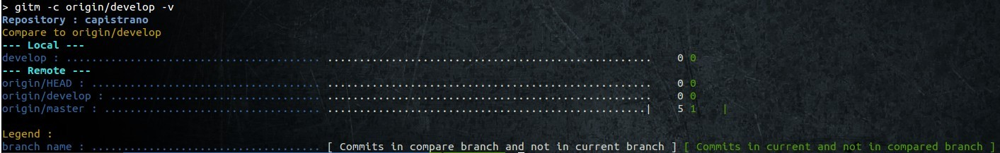

# Gitm

Gitm is just an helper to manage git branches.

I use this tool when i got multiple branches to manage and want to show which is ahead and behind.

Exemple : branch comparaison 



## Installation

You must install package cmake to allow run of rugged

```bash
sudo apt-get install cmake
```

### Local usage

```bash
$ bundle install
$ gitm [options] path

ex : gitm -lvv /home/mayfly/perso/github
```

### System install

```bash
$ bundle install
$ sudo rake install
```

## Usage

Usage: gitm [path] [options]
```
    -l, --list                       List founded repositories
    -f, --fetch                      Play a fetch -p on each repositories
    -c, --compare [ref_branch]       Show comparaison of the parameter branch with the other branches (use -v to show remote)
    -s, --search [text_to_find]      find commits which contains text_to_find
```

Linked with bug tracker:
```
    -b, --feature-info               Show repositories infos on features
    -i, --issue [issue_number]       show ticket datas
```

Common options:
```
    -v, --verbose                    Verbose (use -vv to very verbose)
    -h, --help                       Show this message
        --version                    Show version
```
Setup options:
```
        --show-bt                    Show bug tracker list
        --setup-add-bug-tracker      Add bug tracker
        --setup-add-bt-link          Add bug tracker link to repository
```

## Contributing

1. Fork it
2. Create your feature branch (`git checkout -b my-new-feature`)
3. Commit your changes (`git commit -am 'Add some feature'`)
4. Push to the branch (`git push origin my-new-feature`)
5. Create new Pull Request